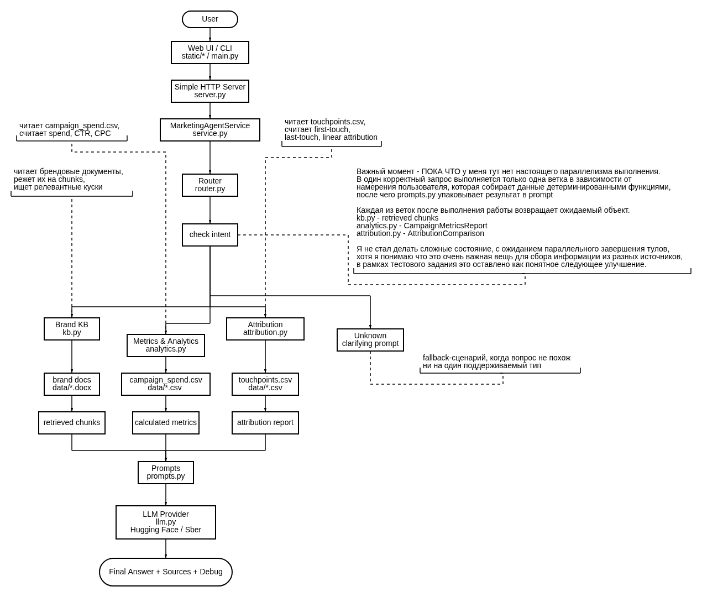

# Marketing AI Agent

Небольшой агент по marketing analytics. Он отвечает на вопросы по kb, считает метрики и показывает простую аттрибуцию. Метрики считаются кодом и парсятся кодом, LLM только объясняет уже подготовленный контекст. Сейчас он очень сильно упрощён.

## Техническая база

Проект собран на основе [ScriptedLLM-ChatBot](https://github.com/gotogrub/ScriptedLLM-ChatBot). Ну и как основной reference framework был взят [ScriptedLLM](https://github.com/gotogrub/ScriptedLLM), но без тех новоротов которые я реализовывал по типу scripted guardrails и контролируемого LLM output'а.

В runtime также нету scripted provider'а и нет заготовленных ответов. После адаптации остались только реальные LLM provider и роутер переписанный под Hugging Face и Sber/GigaChat (потому что у них бесплатные API да-да).

P.S. - sber api пока не тестировалось, лучше тестировать через HF

## Что взято из ScriptedLLM-ChatBot

- супер простой HTTP server на стандартной библиотеке и отдача static UI
- центральный service layer, который роутит вопрос и собирает ответ
- идея SQLite истории сообщений
- локальный retrieval по чанкам и scoring по токенам
- dataclass схемы для ответов, метрик и debug payload
- базовая структура проекта

Куча всего интересного не было перенесено, из-за нехватки времени, например сценарии диалогов, заскриптованные ответы и LangGraph workflow. Пока они были бы лишними для простой marketing analytics задачи.

## Принцип работы

Агент работает с файлами из data:

.docx документы используются как brand knowledge base для tone of voice, продуктовых заметок, channel notes и claims restrictions.

Например campaign_spend.csv используется для spend, impressions, clicks, CTR и CPC, а touchpoints.csv используется для last-touch, first-touch и линейной аттрибуции.

Схема работы:



## Запуск

1. Создать .env по примеру .env.example, затем просто запустить:

```bash
python main.py ingest
python main.py ui --port 8082
```

После этого UI будет доступен на `http://127.0.0.1:8082`.

2. Способ попроще, без UI:

```bash
python main.py ask "Сравни Meta и TikTok по CTR и CPC"
```

Проверка provider:

```bash
python main.py check-hf
python main.py check-sber
```

## Что за что отвечает

`main.py` запускает UI, ingestion, CLI-вопросы и проверки provider

`src/marketing_agent/service.py` это основной пайплайн агента

`src/marketing_agent/router.py` выбирает сценарий вопроса

`src/marketing_agent/kb.py` читает brand docs и ищет релевантные chunks

`src/marketing_agent/analytics.py` считает campaign metrics из CSV

`src/marketing_agent/attribution.py` считает rule based attribution

`src/marketing_agent/llm.py` содержит Hugging Face и Sber/GigaChat clients

`src/marketing_agent/prompts.py` собирает сообщения для LLM

`src/marketing_agent/server.py` и `static/*` отвечают за простой web UI

## Тесты

Тесты были написаны на скорую руку, так что было решено закинуть их в .gitignore пока.
